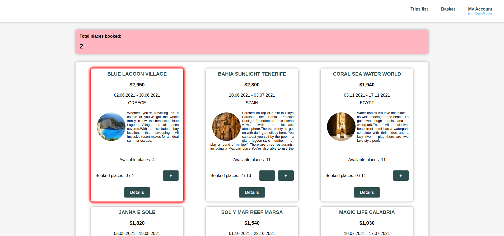
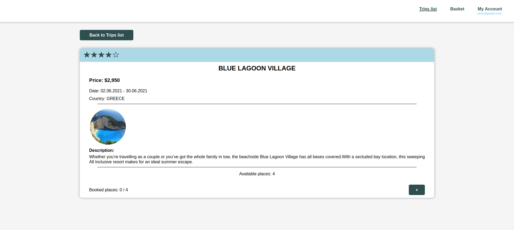
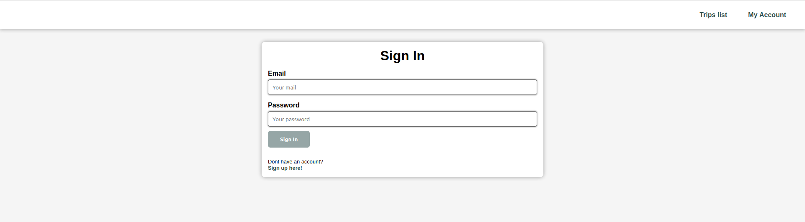
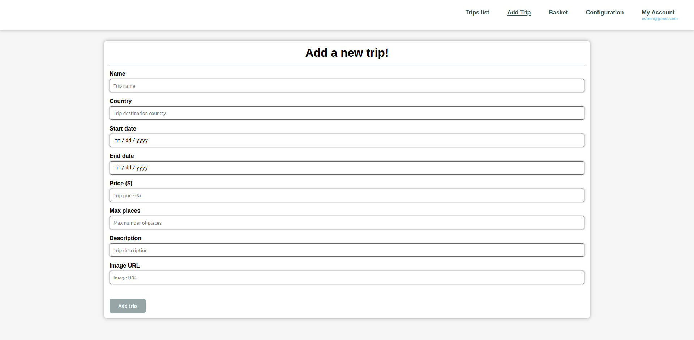
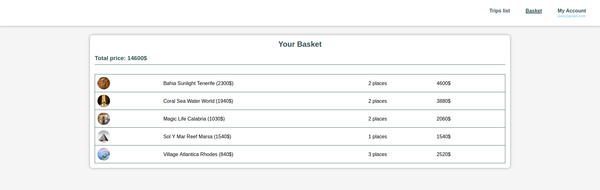
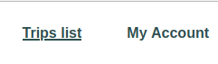
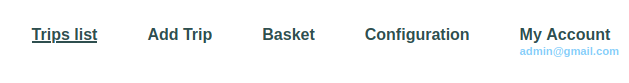

# TravelAgency - Web App

---

## Table of contents
* [Overview](#Overview)
* [Technologies](#Technologies)
* [Main components](#Main-components)
* [Key features](#Key-features)
* [Setup](#Setup)
* [Development State](#Development-State)
* [License](#License)

## Overview
[TravelAgencyWebApp](https://github.com/JakubNowobilski/TravelAgencyWebApp) has been created as part of my Introduction to Web Applications university course. It provides functionality of a simple Travel Agency. It allows browsing trips and making reservations. Admin features include adding new trips and setting authentication persistence. All project requirements assigned by the tutor are listed in [project requirements](project_requirements.txt).

## Technologies
* [Angular 11.2.11](https://v11.angular.io/docs)
* [AngularFire 6.1.4](https://github.com/angular/angularfire)
* [Firebase Realtime Database](https://firebase.google.com/docs/database)
* [Firebase Authentication](https://firebase.google.com/docs/auth)

## Main components
### Trips listing

   
### Trip details

### Sign in

### Add new trip

### Basket

## Key features
* **Data provider** - data is provided and stored with [Firebase Realtime Database](https://firebase.google.com/docs/database) which is also used for user authorisation. Images are stored with [Firebase Cloud Storage](https://firebase.google.com/docs/storage).
* **Users and authentication** - Users are authenticated using [Firebase Authentication](https://firebase.google.com/docs/auth). There are 4 types of users:
  * **Guest** (not logged in) - has the least privileges. Is allowed only to browse trips.
  * **Reader** (logged in) - regular user. Is allowed to browse trips and make reservations. Anyone can register as this type of user.
  * **Worker** (of travel agency) - is allowed to add new trips. They can be registered only manually.
  * **Admin** - has all the privileges of worker, and additionally can remove trips and manage authentication persistence.
* **Contextual views** - additional menus, buttons and other components only appear for certain types of users.

  |  |
  |:---:|
  | *Guest navbar* |

  |  |
  |:---:|
  | *Admin navbar* |

* **Guards** - guards are set to protect certain components of application from unauthorised access. For example guests (not logged-in users) are not allowed to access basket page and if they try to access it directly from URL, they are redirected to page-not-found page.

## Setup
If you want to play with the app on your own, there are few steps to follow to make it run on your machine.
1. Sign up for [Google Firebase](https://firebase.google.com/).
2. Create new realtime database and upload [sample data](assets/sample-data.json).
3. Set cloud storage and upload [sample images](assets/sample-pics).
4. In Firebase Console go to project settings, find your SDK configuration and copy it to [environment.ts](../src/environments/environment.ts) and [environment.prod.ts](../src/environments/environment.prod.ts).
5. Run **npm install**
6. Run **ng serve**
7. Open your app at [localhost:4200](http://localhost:4200/)

Alternatively, if you are not interested in setting up Firebase, you can set other data provider (e.g. REST API) using this [sample data](assets).

## Development State

The work on the project is done, but here are some possible directions of development:
* Trips filtering and sorting
* Introduce RWD
* Implement individual baskets
* Implement trips rating system  
* Allow image upload
* Develop the process of making reservation

## License

This project is licensed under the terms of the MIT [license](LICENSE.md).
